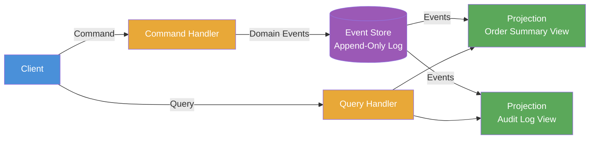

# CQRS & Event Sourcing

> CQRS separates read and write models into distinct paths; Event Sourcing persists state as an append-only log of domain events rather than current values.

## Overview

Command Query Responsibility Segregation (CQRS) is the principle that the model used to mutate state (the write side, or command model) should be distinct from the model used to read state (the read side, or query model). The two sides evolve independently, are optimised for different access patterns, and can be scaled separately.

Event Sourcing is the practice of storing state changes as a sequence of immutable domain events rather than overwriting a current-state record. To determine the current state of an entity, the event log is replayed from the beginning (or from a snapshot). The event log becomes the single source of truth; current-state projections are derived views.

The two patterns are complementary but independent. CQRS can be applied without Event Sourcing (using separate read/write databases). Event Sourcing can be applied without CQRS (reading state directly from the event log). Combined, they provide a powerful model for complex domains: commands produce events, events are persisted in the event store, and read models (projections) are built from those events and optimised for specific query needs.

## Intent

- Optimise read and write paths independently for their respective access patterns.
- Provide a complete, auditable history of every state change in the system.
- Enable temporal queries — reconstruct the state of the system at any point in the past.
- Support multiple specialised read models built from the same event stream.

## When to Use

- Domains with complex business logic where separating the write model from read concerns simplifies both.
- Systems with asymmetric read/write loads that need independent scaling of each path.
- Domains requiring a full audit trail, regulatory compliance, or event-driven integration with downstream systems.
- Applications where replaying events to rebuild or migrate projections is a first-class requirement.

## When to Avoid

- Simple CRUD systems where the complexity of dual models exceeds the benefit.
- Teams new to the pattern — the learning curve is steep; introduce it in bounded areas first.
- Domains with simple, low-volume state that does not benefit from an event log.
- Systems where query latency requirements cannot tolerate eventual consistency between command and read models.

## Structure

## Key Components

| Component | Responsibility |
|-----------|---------------|
| Command | An intent to change state. Validated and processed by a Command Handler. May be rejected. |
| Command Handler | Loads the aggregate, executes domain logic, and emits domain events on success. |
| Domain Event | Immutable record of a state change that has occurred. Named in past tense (`OrderPlaced`, `PaymentFailed`). |
| Event Store | Append-only log of all domain events. The authoritative source of truth for the system. |
| Aggregate | Domain entity that encapsulates invariants; reconstituted by replaying its events from the store. |
| Projection | A derived read model built by consuming the event stream. Optimised for specific query patterns. |
| Query Handler | Serves read requests from projections; never touches the event store directly. |

## Trade-offs

| Benefit | Cost |
|---------|------|
| Complete audit trail — every state change is preserved | Significant increase in conceptual and implementation complexity |
| Read models optimised per use case without affecting the write model | Eventual consistency between command execution and query model availability |
| Time-travel queries — reconstruct state at any historical point | Event schema evolution requires careful versioning strategy (upcasting) |
| Natural integration bus — event store doubles as an event source for other services | Querying current state requires materialised projections; there is no single simple read path |

## Implementation Notes

- Events must be immutable and named in the past tense. Once written to the store, an event cannot change — only a new compensating event can correct a mistake.
- Design aggregates around transactional boundaries, not data relationships. An aggregate is the unit of consistency, not just a domain object.
- Use snapshots to avoid replaying long event streams when reconstituting aggregates with thousands of events.
- Version events with an explicit `schemaVersion` field from day one. Implement upcasters to transform older event formats when loading from the store.
- Projections are disposable and rebuildable. If a query requirement changes, create a new projection by replaying the event store — this is one of the pattern's most powerful properties.
- Document the write model (aggregate design) and read models (projections) separately in your `ARCHITECTURE.md` — they serve different audiences.

## Related Patterns

- [Event-Driven Architecture](./event-driven-architecture.md) — the event store can serve as an event source for downstream consumers across service boundaries.
- [Domain-Driven Design](./domain-driven-design.md) — aggregates, bounded contexts, and ubiquitous language provide the modelling foundation for the command side.
- [Microservices Architecture](./microservices-architecture.md) — CQRS is commonly applied within individual microservices to manage internal read/write asymmetry.
- [Layered Architecture](./layered-architecture.md) — CQRS can be introduced incrementally within a layered system's Application Layer.

## Further Reading

- [mehdihadeli/awesome-software-architecture](https://github.com/mehdihadeli/awesome-software-architecture) — comprehensive CQRS and Event Sourcing article catalogue.
- [simskij/awesome-software-architecture](https://github.com/simskij/awesome-software-architecture) — concise CQRS and Event Sourcing reference.
- [DovAmir/awesome-design-patterns](https://github.com/DovAmir/awesome-design-patterns) — includes CQRS implementation patterns across stacks.
