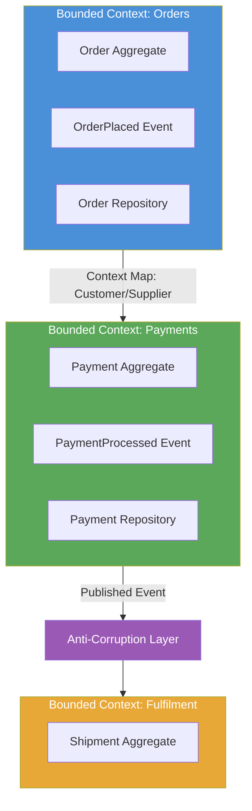

# Domain-Driven Design

> A software development approach that centres the design on the core business domain, using a shared language between technical and domain experts to build a model that reflects real-world concepts accurately.

## Overview

Domain-Driven Design (DDD) is both a philosophy and a toolkit for tackling complex software domains. Its central premise is that the structure and language of the codebase should mirror the structure and language of the business domain. When developers and domain experts share a common vocabulary — the Ubiquitous Language — the model in the code and the mental model of the business converge, reducing translation errors and making the system easier to evolve.

DDD provides two distinct sets of patterns. Strategic patterns operate at the macro level: Bounded Contexts define the explicit boundaries within which a model is valid; Context Maps describe the relationships between those contexts. Tactical patterns operate at the micro level: Aggregates, Entities, Value Objects, Domain Events, Repositories, and Services provide the building blocks for expressing domain logic precisely.

The most common mistake in adopting DDD is applying the tactical patterns (Aggregates, Repositories) without the strategic foundation. Tactical patterns in the wrong context produce complexity without benefit. Strategic patterns — particularly Bounded Contexts — are the highest-value part of DDD and are worth adopting even without the full tactical toolkit.

## Intent

- Align the software model with the business domain so that domain experts and developers can collaborate on the same model.
- Establish explicit boundaries (Bounded Contexts) within which a model is valid and self-consistent.
- Encode business rules and invariants in domain objects rather than scattering them across services or database procedures.
- Produce a design that evolves gracefully as the business domain changes.

## When to Use

- Complex business domains where the rules, workflows, and terminology are not trivially simple.
- Systems with multiple teams where explicit context boundaries reduce integration friction.
- Long-lived systems that need to be evolved and extended over years without accumulating design debt.
- Domains where tight collaboration between developers and subject-matter experts is possible.

## When to Avoid

- Simple CRUD systems with no meaningful business logic — the modelling overhead is not justified.
- Domains where subject-matter experts are unavailable for ongoing collaboration.
- Short-lived projects or prototypes where long-term maintainability is not a priority.
- Teams new to object-oriented design — build that foundation before adopting DDD's tactical patterns.

## Structure

## Key Components

| Component | Responsibility |
|-----------|---------------|
| Ubiquitous Language | Shared vocabulary used in conversation, documentation, and code within a Bounded Context. |
| Bounded Context | Explicit boundary within which a domain model is valid. Different contexts may use the same term to mean different things. |
| Context Map | Diagram and documentation of the relationships and integration patterns between Bounded Contexts. |
| Aggregate | Cluster of domain objects treated as a single unit for data changes. The root entity enforces all invariants. |
| Entity | Object with a distinct identity that persists through state changes (e.g., an Order with an order ID). |
| Value Object | Object defined entirely by its attributes with no distinct identity; immutable (e.g., a Money amount). |
| Domain Event | Immutable record of something significant that has occurred within the domain. |
| Repository | Abstraction over persistence that speaks in domain terms; hides storage implementation details. |
| Anti-Corruption Layer | Translation layer that protects a Bounded Context from the model of another context or legacy system. |

## Trade-offs

| Benefit | Cost |
|---------|------|
| Codebase mirrors domain — reduced translation between code and business requirements | Significant upfront modelling investment before development accelerates |
| Explicit context boundaries reduce integration ambiguity between teams | Requires sustained collaboration with domain experts throughout development |
| Invariants enforced in domain objects — business rules are not scattered across the codebase | Tactical patterns (Aggregates, Repositories) add complexity in simple scenarios |
| Context Map makes cross-team dependencies explicit and manageable | DDD vocabulary and concepts have a steep learning curve |

## Implementation Notes

- Start with strategic patterns: identify Bounded Contexts and draw a Context Map before writing any tactical code. This is the highest-leverage activity in DDD.
- Name every class, method, and variable using the Ubiquitous Language of its Bounded Context. If you need to translate between a domain term and a code construct, the language has drifted.
- Aggregates should be kept small. A common anti-pattern is building large aggregates that lock too much data per transaction. Design aggregates around transactional boundaries, not object relationships.
- Use Value Objects aggressively. Most primitive fields (`String email`, `int price`) should be Value Objects — they encode validation and meaning that strings and integers cannot.
- Document Bounded Contexts and Context Map relationships as ADRs (see [adr/madr](https://github.com/adr/madr)) and as C4 diagrams (see [Structurizr](https://github.com/structurizr)).

## Related Patterns

- [Hexagonal Architecture](./hexagonal-architecture.md) — provides the structural pattern for isolating the domain model from infrastructure within a Bounded Context.
- [CQRS & Event Sourcing](./cqrs-event-sourcing.md) — Aggregates and Domain Events are the natural foundation for the CQRS command model.
- [Microservices Architecture](./microservices-architecture.md) — Bounded Contexts are the primary guide for identifying correct service boundaries.
- [Event-Driven Architecture](./event-driven-architecture.md) — Domain Events are the natural integration mechanism between Bounded Contexts.

## Further Reading

- [mehdihadeli/awesome-software-architecture](https://github.com/mehdihadeli/awesome-software-architecture) — extensive DDD article and resource catalogue.
- [DovAmir/awesome-design-patterns](https://github.com/DovAmir/awesome-design-patterns) — DDD patterns alongside broader design pattern catalogues.
- [simskij/awesome-software-architecture](https://github.com/simskij/awesome-software-architecture) — concise DDD reference.
