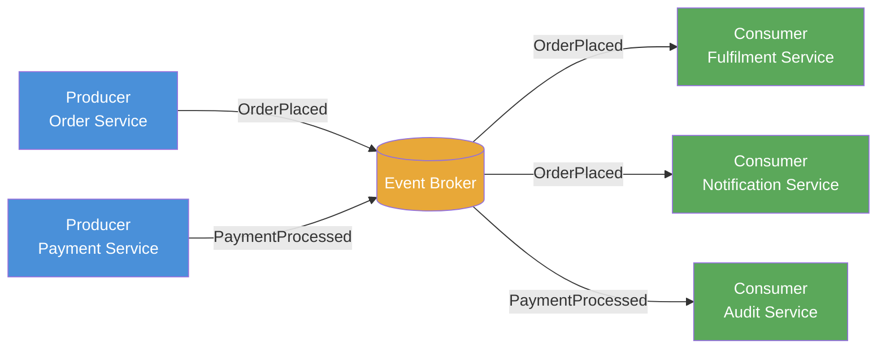

# Event-Driven Architecture

> A system design style where components communicate exclusively through the production, routing, and consumption of events rather than direct synchronous calls.

## Overview

In Event-Driven Architecture (EDA), the fundamental unit of communication is the event — an immutable record that something of significance has occurred. Producers emit events without knowledge of who will consume them; consumers react to events without knowledge of who produced them. A broker (message queue or event streaming platform) mediates between the two, providing durability and routing.

EDA decouples producers and consumers in time, space, and logic. A payment service can emit a `PaymentProcessed` event and continue immediately; downstream services (fulfilment, notifications, audit) react at their own pace. This asynchrony is EDA's greatest strength and its primary source of operational complexity.

The pattern scales naturally — adding a new consumer requires no change to the producer. Complexity shifts to the event contracts themselves, which become the primary API surface of the system. Maintaining backward-compatible event schemas is as important in EDA as maintaining backward-compatible REST endpoints in synchronous systems.

## Intent

- Decouple producers and consumers so that neither depends on the other's availability or implementation.
- Enable asynchronous, non-blocking communication as the default.
- Support adding new capabilities (consumers) without modifying existing producers.
- Create an auditable, replayable record of what has happened in the system.

## When to Use

- Workflows where steps are naturally asynchronous and independent (order processing, notifications, analytics pipelines).
- Systems integrating many services with different scaling profiles.
- Domains where replaying history or reconstructing state from events is valuable.
- Architectures that need to evolve by attaching new consumers without changing upstream services.

## When to Avoid

- Simple request/response interactions where a synchronous answer is required immediately.
- Small systems where the operational overhead of a broker outweighs the decoupling benefit.
- Workflows requiring strict transactional consistency across multiple services without a compensating strategy (see [Saga Pattern](./saga-pattern.md)).
- Teams without experience managing event schema evolution and consumer lag.

## Structure

## Key Components

| Component | Responsibility |
|-----------|---------------|
| Event | Immutable record of a domain fact. Carries a type, timestamp, source identifier, and payload. |
| Producer | Emits events when domain facts occur. Has no knowledge of downstream consumers. |
| Event Broker | Routes events from producers to subscribers. Provides durability, ordering guarantees, and replay capability. |
| Consumer | Subscribes to one or more event types and reacts to them. Maintains its own processing position (offset). |
| Schema Registry | Governs event contracts and enforces backward compatibility during schema evolution. |

## Trade-offs

| Benefit | Cost |
|---------|------|
| Temporal and logical decoupling between services | Eventual consistency — consumers may lag behind producers |
| Horizontal scalability — consumers scale independently | Distributed tracing and end-to-end debugging are significantly harder |
| Extensible — new consumers require no producer changes | Event schema evolution must be managed explicitly and carefully |
| Natural audit log when events are persisted durably | Complexity of exactly-once delivery semantics and idempotent consumers |

## Implementation Notes

- Design events around domain facts, not commands. `OrderPlaced` is an event; `PlaceOrder` is a command. The distinction matters for consumer semantics and replayability.
- Version event schemas from the start. Use Avro, Protobuf, or JSON Schema with a schema registry to enforce compatibility.
- Consumers must be idempotent — the broker may deliver the same event more than once under failure conditions.
- Use correlation IDs to trace a logical workflow across multiple events and consumers in your observability tooling.
- Encode broker topology and event contract decisions as ADRs using [MADR](https://github.com/adr/madr).

## Related Patterns

- [CQRS & Event Sourcing](./cqrs-event-sourcing.md) — Event Sourcing persists state as an ordered event stream, a natural complement to EDA.
- [Microservices Architecture](./microservices-architecture.md) — EDA is a common integration pattern between independently deployed services.
- [Saga Pattern](./saga-pattern.md) — coordinates long-running distributed workflows using events and compensating transactions.
- [Space-Based Architecture](./space-based-architecture.md) — uses event-driven messaging to synchronise distributed processing units.

## Further Reading

- [mehdihadeli/awesome-software-architecture](https://github.com/mehdihadeli/awesome-software-architecture) — deep catalogue of EDA articles, videos, and resources.
- [DovAmir/awesome-design-patterns](https://github.com/DovAmir/awesome-design-patterns) — includes cloud-native and serverless EDA patterns.
- [simskij/awesome-software-architecture](https://github.com/simskij/awesome-software-architecture) — concise EDA and Event Sourcing reference.
