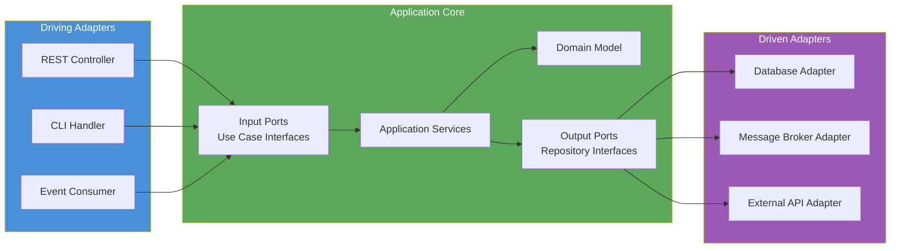

# Hexagonal Architecture

> Isolates core business logic from external concerns by placing the domain at the centre and connecting all external systems — databases, APIs, UIs — through explicitly defined ports and adapters.

## Overview

Hexagonal Architecture, also known as Ports and Adapters, was introduced by Alistair Cockburn to solve a persistent problem in layered systems: business logic becomes entangled with infrastructure. When domain code calls a database directly, or when a controller contains business rules, the domain cannot be tested or reasoned about in isolation.

The pattern inverts this dependency. The domain sits at the centre and defines the interfaces it needs (Ports). Everything external — databases, message brokers, HTTP clients, UIs — provides implementations of those interfaces (Adapters). The domain never depends on infrastructure; infrastructure depends on the domain. The domain can be exercised with in-memory adapters in tests without starting a database or an HTTP server.

The "hexagon" in the name is not a precise geometric metaphor — Cockburn used six sides to convey that the application has multiple entry points and multiple exit points, and that none is architecturally privileged. In practice, the pattern is applied as two concentric zones: the inner application core and the outer adapters layer, with ports forming the contract boundary between them.

## Intent

- Protect core business logic from changes to external systems (databases, APIs, messaging platforms).
- Enable the application core to be tested in complete isolation without infrastructure.
- Make it straightforward to swap infrastructure implementations (e.g., swap Postgres for DynamoDB) without touching the domain.
- Provide a clean, testable boundary for each external dependency.

## When to Use

- Any system where business logic is non-trivial and must be tested without infrastructure.
- Services within a [Microservices Architecture](./microservices-architecture.md) — hexagonal is the recommended internal structure for each service.
- Domains modelled with [Domain-Driven Design](./domain-driven-design.md) — ports and adapters enforce the separation between domain model and infrastructure that DDD prescribes.
- Systems that need to support multiple UI types or integration channels (REST API, CLI, event consumer) driven by the same application core.

## When to Avoid

- Simple CRUD services with no business logic — the pattern adds indirection without benefit.
- Teams unfamiliar with dependency inversion — ensure the team understands why infrastructure must depend on the domain before adopting this structure.

## Structure

## Key Components

| Component | Responsibility |
|-----------|---------------|
| Domain Model | Core business logic, entities, value objects, and invariants. Has zero dependencies on external systems. |
| Application Services | Orchestrate use cases by coordinating domain objects and calling output ports. |
| Input Port | Interface (or use-case contract) that driving adapters call to interact with the application. |
| Output Port | Interface that the application core calls to interact with external systems; defined by the domain's needs. |
| Driving Adapter | Translates an external trigger (HTTP request, CLI command, event) into a call to an input port. |
| Driven Adapter | Implements an output port; translates domain calls into interactions with a specific external system. |

## Trade-offs

| Benefit | Cost |
|---------|------|
| Domain is fully testable in isolation without infrastructure | Requires disciplined adherence — shortcuts (e.g., importing ORM models into the domain) break the pattern |
| Infrastructure can be swapped without modifying the domain | Port/adapter indirection adds boilerplate, particularly for simple data access |
| Multiple delivery mechanisms (REST, CLI, events) share the same application core | Teams must internalise dependency inversion; the learning curve is non-trivial |
| Clear, explicit contracts between the domain and all external systems | More files and abstractions than a flat layered approach |

## Implementation Notes

- The direction of dependency must always point inward. Domain code must never import from an adapter or an infrastructure library. Enforce this with module boundaries or linting rules.
- Output ports should be defined in terms of what the domain needs, not in terms of what the database provides. A `UserRepository` port returns domain `User` objects, not ORM entities.
- Use in-memory adapter implementations as the default in unit tests. Reserve integration tests with real infrastructure for adapter implementations only.
- Input ports map closely to use cases. One input port per use case is a useful starting heuristic.
- Document the port contracts explicitly — they are the stable API surface of the application core. Version them as carefully as a public REST API.

## Related Patterns

- [Domain-Driven Design](./domain-driven-design.md) — hexagonal architecture is the structural pattern that enforces DDD's separation between domain model and infrastructure.
- [Layered Architecture](./layered-architecture.md) — hexagonal can be understood as a stricter, inside-out evolution of the layered pattern.
- [Microservices Architecture](./microservices-architecture.md) — recommended internal structure for individual microservices.
- [CQRS & Event Sourcing](./cqrs-event-sourcing.md) — command handlers and query handlers map naturally to input ports in a hexagonal service.

## Further Reading

- [mehdihadeli/awesome-software-architecture](https://github.com/mehdihadeli/awesome-software-architecture) — hexagonal architecture articles and implementation examples.
- [DovAmir/awesome-design-patterns](https://github.com/DovAmir/awesome-design-patterns) — ports and adapters alongside related clean architecture patterns.
- [Structurizr](https://github.com/structurizr) — use C4 diagrams to model the port/adapter boundary in version-controlled architecture documentation.
