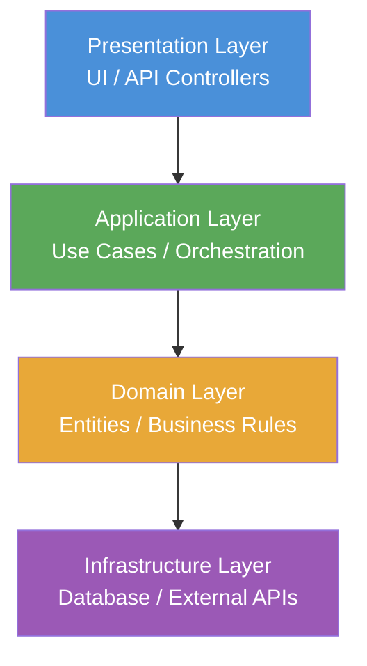

# Layered Architecture

> Organises a system into horizontal tiers where each layer has a distinct responsibility and communicates only with adjacent layers.

## Overview

Layered Architecture — also called N-Tier or Multi-Tier — is the most broadly adopted structural pattern in enterprise software. The system is divided into discrete horizontal layers, most commonly: Presentation, Application, Domain, and Infrastructure. Each layer provides services to the layer above and consumes services from the layer below.

The primary virtue of this pattern is separation of concerns. Changes to the database engine should not ripple into the UI; changes to presentation should not corrupt business rules. This containment makes the system independently modifiable in each tier and straightforward to reason about.

Layered Architecture is the natural starting point for most new systems. Its familiarity reduces onboarding time and its structure maps cleanly to team specialisations. It becomes strained when business logic accumulates in the wrong layers or when cross-cutting concerns cause high fan-out across all tiers.

## Intent

- Separate presentation, business logic, and data access into cohesive, isolated tiers.
- Allow each layer to be developed, tested, and replaced independently.
- Establish a unidirectional dependency direction: upper layers depend on lower layers, never the reverse.
- Provide a foundation that can evolve toward more sophisticated patterns as complexity grows.

## When to Use

- Line-of-business applications with a clear UI, processing, and persistence boundary.
- Teams organised by technical specialisation (front-end, back-end, DBA).
- Systems that need to be understood and maintained by rotating or growing teams.
- Early-stage products where simplicity of mental model outweighs architectural sophistication.

## When to Avoid

- High-throughput systems where passing data through unnecessary layers introduces latency.
- Domains where cross-cutting features naturally span all layers ("lasagna" anti-pattern).
- Systems that need to scale individual capabilities independently — consider [Microservices](./microservices-architecture.md).
- When business logic is rich enough to warrant a formal domain model — consider [Hexagonal Architecture](./hexagonal-architecture.md) or [DDD](./domain-driven-design.md).

## Structure

## Key Components

| Component | Responsibility |
|-----------|---------------|
| Presentation Layer | Handles user interaction; translates input into application commands and renders output. |
| Application Layer | Orchestrates use cases; coordinates domain objects without containing business rules itself. |
| Domain Layer | Encapsulates core business logic, entities, and invariants. The most stable part of the system. |
| Infrastructure Layer | Implements technical concerns: persistence, messaging, and third-party integrations. |

## Trade-offs

| Benefit | Cost |
|---------|------|
| Simple mental model — easy to onboard new team members | Risk of bloated service layers where all logic accumulates |
| Clear location for every concern | Changes often require modifications across multiple layers |
| Testable — each layer can be isolated and mocked at its boundary | Strict layering can introduce unnecessary indirection for simple reads |
| Maps naturally to common team structures | Does not support scaling individual capabilities independently |

## Implementation Notes

- Enforce layer isolation through module or package boundaries, not just convention — the compiler should make violations visible.
- Treat the Domain Layer as the anchor: avoid letting business logic bleed into Application or Infrastructure layers.
- Consider allowing the Application Layer to bypass the Domain Layer for pure read operations to avoid unnecessary object construction (a lightweight CQRS approach).
- Encode layer boundary decisions as Architectural Decision Records using [MADR](https://github.com/adr/madr) so future maintainers understand the intent.
- Model the system visually using the C4 Container diagram (see [Structurizr](https://github.com/structurizr)) to communicate layer responsibilities to stakeholders.

## Related Patterns

- [Hexagonal Architecture](./hexagonal-architecture.md) — isolates the domain from infrastructure more rigorously using ports and adapters.
- [Domain-Driven Design](./domain-driven-design.md) — enriches the Domain Layer with a formal modelling language and bounded contexts.
- [CQRS & Event Sourcing](./cqrs-event-sourcing.md) — extends layered systems by separating read and write paths.
- [Microservices Architecture](./microservices-architecture.md) — decomposes a layered monolith into independently deployable services.

## Further Reading

- [DovAmir/awesome-design-patterns](https://github.com/DovAmir/awesome-design-patterns) — comprehensive catalogue including layered pattern variants.
- [jy-yi/Software-Architecture-Patterns](https://github.com/jy-yi/Software-Architecture-Patterns) — concise reference covering layered alongside other core patterns.
- [mehdihadeli/awesome-software-architecture](https://github.com/mehdihadeli/awesome-software-architecture) — curated articles on layered architecture and its evolution.
