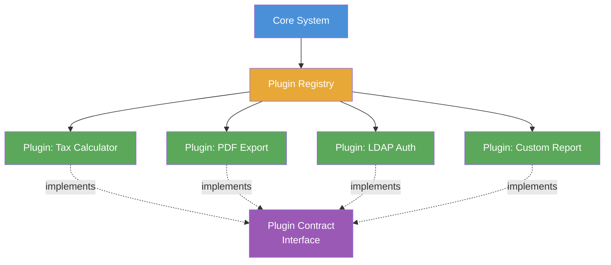

# Microkernel Architecture

> A structural pattern that separates a minimal, stable core system from a set of independently developed and deployed plugins that extend its behaviour.

## Overview

Microkernel Architecture — also called the Plugin Architecture — divides a system into two components: a core system and a set of plug-in modules. The core system contains the minimal functionality required to keep the system operational. Plug-ins provide specialised behaviour, additional features, or domain-specific processing that extends the core without modifying it.

The pattern encodes the Open/Closed Principle at the architectural level: the core system is closed to modification but open to extension. Adding a new capability means writing a new plugin, not changing the core. This separation allows the core to stabilise while the ecosystem of plugins continues to grow and evolve independently — often across different teams or third-party contributors.

This pattern appears in a wide range of software: IDEs (VS Code extensions), web browsers (add-ons), build tools (webpack loaders, Vite plugins), rule engines, and workflow platforms. The defining characteristic in all cases is a plugin registry and a stable contract between the core and its extensions.

## Intent

- Isolate the minimal stable core from volatile, domain-specific, or third-party extensions.
- Allow capabilities to be added, removed, or updated without modifying or redeploying the core system.
- Support independent development and deployment of plugins by different teams or vendors.
- Provide a clear extension contract that makes the system safely extensible.

## When to Use

- Products that need to support a variety of configurations, domains, or integration points without a monolithic feature set.
- Platforms where third-party or community-developed extensions are part of the product strategy.
- Systems with a stable processing pipeline where domain-specific steps vary by deployment context.
- Tools and developer platforms (IDEs, CLI tools, build systems) where extensibility is a first-class feature.

## When to Avoid

- Systems with no genuine extensibility requirement — the plugin registry adds complexity that benefits only extension scenarios.
- Domains where plugin isolation is difficult to enforce and poorly written plugins risk destabilising the core.
- High-throughput data paths where the indirection and registry lookup overhead is unacceptable.

## Structure

## Key Components

| Component | Responsibility |
|-----------|---------------|
| Core System | Provides the minimal runtime, shared services, and orchestration logic. Stable and infrequently changed. |
| Plugin Contract | The interface (or extension point) that all plugins must implement. Defines the boundary between core and plugin. |
| Plugin Registry | Discovers, loads, and manages the lifecycle of installed plugins. Maps plugin identifiers to implementations. |
| Plugin | Self-contained module that implements the plugin contract to provide a specific capability. |
| Plugin Manager | (Optional) Handles plugin installation, versioning, dependency resolution, and activation. |

## Trade-offs

| Benefit | Cost |
|---------|------|
| Core system is stable and independently testable | Plugin contract design is critical and expensive to change once plugins exist |
| New capabilities added without modifying the core | Poorly isolated plugins can share state and destabilise the core |
| Independent deployment and versioning of each plugin | Plugin discovery, loading, and lifecycle management adds implementation complexity |
| Natural fit for third-party or community extension ecosystems | Performance overhead from registry lookup and dynamic dispatch in hot paths |

## Implementation Notes

- Design the plugin contract with care — it is the most important and hardest-to-change interface in the system. Treat it as a public API from day one.
- Version the plugin contract explicitly. Use semantic versioning and maintain backward compatibility; breaking contract changes require a major version and a migration path for existing plugins.
- Isolate plugins from each other. Plugins should not communicate directly — all interactions should be mediated through the core or through explicit shared services it exposes.
- Provide a clear plugin development guide and a reference plugin implementation. The quality of the extension ecosystem depends on how easy the contract is to implement correctly.
- Log plugin load events, errors, and execution times. When the core misbehaves, the first diagnostic question is "which plugin caused this?"
- Document extension points as ADRs (see [adr/madr](https://github.com/adr/madr)) — changes to the plugin contract require an architectural decision record.

## Related Patterns

- [Layered Architecture](./layered-architecture.md) — the core system typically uses a layered structure internally.
- [Microservices Architecture](./microservices-architecture.md) — plugins deployed as remote services represent a distributed variant of this pattern.
- [Hexagonal Architecture](./hexagonal-architecture.md) — the plugin contract corresponds to an output port; plugins are driven adapters.

## Further Reading

- [jy-yi/Software-Architecture-Patterns](https://github.com/jy-yi/Software-Architecture-Patterns) — concise microkernel pattern reference alongside other core patterns.
- [DovAmir/awesome-design-patterns](https://github.com/DovAmir/awesome-design-patterns) — plugin and extension patterns across multiple paradigms.
- [mehdihadeli/awesome-software-architecture](https://github.com/mehdihadeli/awesome-software-architecture) — broader architecture pattern catalogue including microkernel variants.
