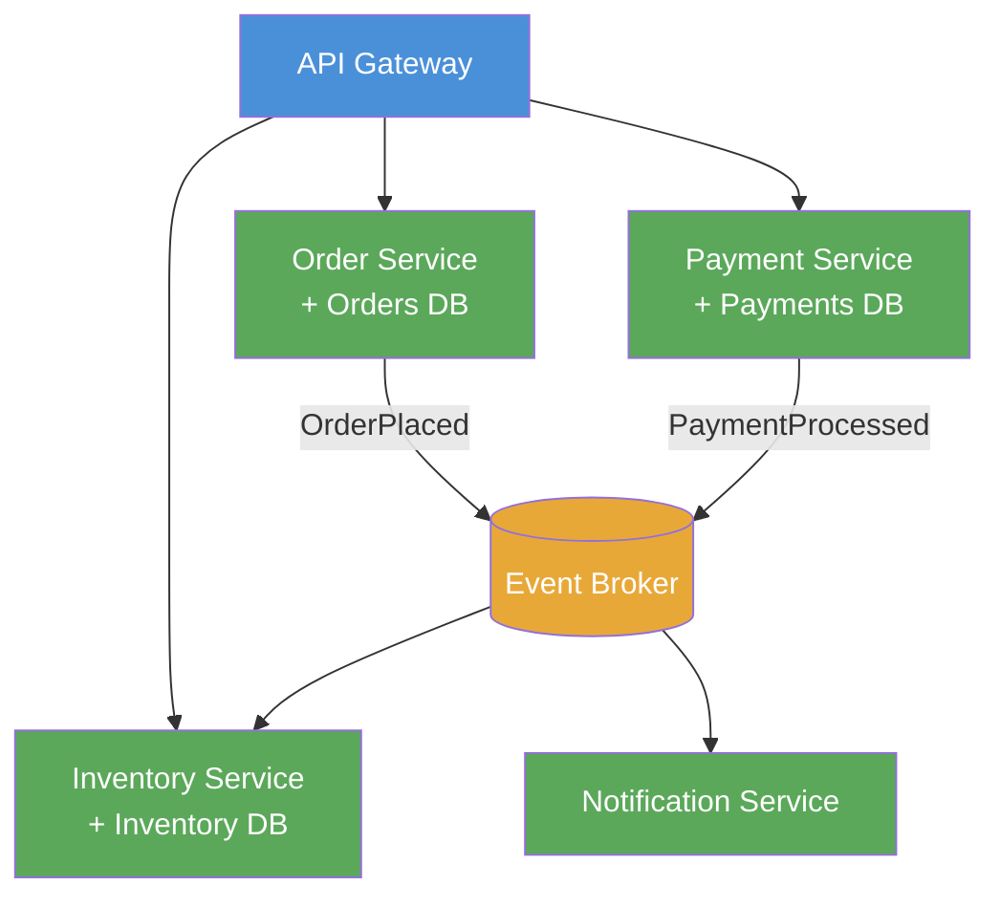

# Microservices Architecture

> A structural style where a system is composed of small, independently deployable services, each owning a single business capability and its data.

## Overview

Microservices Architecture decomposes a system into a collection of loosely coupled services. Each service is built around a specific business capability, deployed independently, communicates over the network, and owns its own data store. No service shares a database with another — the boundary around data is as important as the boundary around code.

The pattern emerged as a response to the limitations of monolithic applications at scale: teams blocking each other, long release cycles, and the inability to scale individual capabilities without scaling the whole. Microservices trade these problems for a different set — distributed systems complexity, network latency, and significant operational overhead that demands mature DevOps practices.

The decision to adopt microservices is as much organisational as it is architectural. Conway's Law dictates that systems mirror the communication structures of the teams that build them. Microservices work best when team boundaries align with service boundaries, and when the organisation can invest in the platform capabilities (CI/CD, service mesh, observability) that make independent deployment safe.

## Intent

- Enable independent deployment of individual business capabilities.
- Allow each service to be scaled, updated, and replaced without affecting others.
- Align service boundaries with team ownership to reduce coordination overhead.
- Enable heterogeneous technology choices per service where the trade-off is justified.

## When to Use

- Large systems where different capabilities have significantly different scaling requirements.
- Organisations with multiple autonomous teams that need to deploy independently.
- Systems that have outgrown a monolith and have well-understood domain boundaries.
- Products requiring high availability where a failure in one capability must not bring down the whole system.

## When to Avoid

- Small teams or early-stage products — the operational overhead exceeds the benefit.
- Systems where domain boundaries are not yet understood (start with a monolith; extract services when seams emerge).
- Organisations without mature CI/CD, container orchestration, and distributed observability practices.
- Workflows requiring strong transactional consistency across multiple entities — distributed transactions are expensive.

## Structure

## Key Components

| Component | Responsibility |
|-----------|---------------|
| Service | Owns a single business capability and its data. Exposes a stable API (REST, gRPC, or events). |
| API Gateway | Single entry point for external clients; handles routing, auth, rate limiting, and protocol translation. |
| Event Broker | Decouples services that communicate asynchronously; provides durability and replay. |
| Service Registry | Tracks running service instances for dynamic discovery and load balancing. |
| Distributed Tracing | Correlates requests across service boundaries for observability and debugging. |

## Trade-offs

| Benefit | Cost |
|---------|------|
| Independent deployment per service — faster release cycles | Distributed systems complexity: network partitions, latency, and partial failure |
| Scale each capability independently to match demand | Data consistency across services requires explicit design (sagas, eventual consistency) |
| Team autonomy — each team owns its service end-to-end | Significant platform investment required (CI/CD, mesh, observability, secrets management) |
| Fault isolation — one service failure does not cascade | Inter-service API contracts must be managed and versioned explicitly |

## Implementation Notes

- Define service boundaries using Domain-Driven Design's Bounded Context (see [Domain-Driven Design](./domain-driven-design.md)). The most common failure mode is cutting services too small before the domain is understood.
- Each service must own its data exclusively. Sharing a database between services negates the independence the pattern provides.
- Implement the [Saga Pattern](./saga-pattern.md) for workflows that span multiple services and require consistency guarantees.
- Use an API Gateway to provide a unified external interface; avoid exposing individual service endpoints directly to clients.
- Adopt the Strangler Fig pattern when migrating from a monolith — extract services incrementally at proven seams rather than rewriting all at once.
- Document service contracts and decisions using ADRs (see [adr/madr](https://github.com/adr/madr)) and visualise the landscape with C4 diagrams (see [Structurizr](https://github.com/structurizr)).

## Related Patterns

- [Domain-Driven Design](./domain-driven-design.md) — Bounded Contexts are the primary tool for identifying correct service boundaries.
- [Event-Driven Architecture](./event-driven-architecture.md) — asynchronous event-based communication between services reduces runtime coupling.
- [Saga Pattern](./saga-pattern.md) — manages distributed workflows and data consistency across service boundaries.
- [Hexagonal Architecture](./hexagonal-architecture.md) — recommended internal structure for each individual microservice.

## Further Reading

- [mehdihadeli/awesome-software-architecture](https://github.com/mehdihadeli/awesome-software-architecture) — deep catalogue of microservices articles and resources.
- [DovAmir/awesome-design-patterns](https://github.com/DovAmir/awesome-design-patterns) — includes cloud-native patterns for service meshes, sidecars, and API gateways.
- [Structurizr](https://github.com/structurizr) — model the service landscape using C4 diagrams kept in version control.
