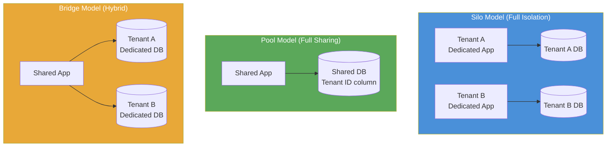

# Multi-Tenancy Patterns

> Design approaches for hosting multiple customers (tenants) on a shared software platform, balancing isolation, resource efficiency, and operational complexity.

## Overview

Multi-tenancy is the property of a single software system serving multiple distinct customers (tenants) from a shared deployment. The central design challenge is striking the right balance between isolation — ensuring that one tenant's data, performance, and behaviour cannot affect another — and efficiency — sharing infrastructure to reduce the cost per tenant.

There is no single multi-tenancy pattern. Instead, there is a spectrum of isolation models, each with distinct trade-offs across security, performance, cost, and operational complexity. The three canonical models are Silo (fully isolated per-tenant deployments), Pool (fully shared infrastructure with logical separation), and Bridge (a blend of shared and isolated resources). Most real-world SaaS platforms use a hybrid that applies different models to different tiers of the product.

The right model is determined by the compliance requirements of the customer segment (regulated industries demand stronger isolation), the platform's cost structure (silo per tenant is expensive at scale), and the technical characteristics of the workload (noisy-neighbour sensitivity, data residency requirements).

## Intent

- Define an explicit isolation model for tenant data, compute, and network resources.
- Prevent cross-tenant data leakage and resource contention (noisy-neighbour effect).
- Enable the platform to onboard new tenants without provisioning new infrastructure.
- Provide flexibility to offer different isolation tiers to different customer segments (e.g., enterprise vs. self-service).

## When to Use

- Any SaaS platform serving multiple customers from a shared codebase or deployment.
- Platforms that need to offer differentiated tiers: a shared tier for cost-sensitive customers and an isolated tier for enterprise or regulated customers.
- Systems with compliance requirements (GDPR, HIPAA, SOC 2) that mandate data isolation or residency.
- Products at a scale where the per-tenant operational cost of fully isolated deployments is prohibitive.

## When to Avoid

- Single-tenant applications — multi-tenancy adds complexity with no benefit.
- Internal tools serving a single organisation — logical isolation within the application is sufficient.

## Structure

## Key Components

| Component | Responsibility |
|-----------|---------------|
| Tenant Context | Identifies the current tenant for every request; propagated through the call stack to enforce isolation at every layer. |
| Tenant Resolver | Extracts tenant identity from the request (subdomain, JWT claim, API key) before business logic executes. |
| Data Partitioning Layer | Enforces that data access is scoped to the current tenant — row-level security, schema separation, or database-per-tenant. |
| Onboarding Pipeline | Automates provisioning of tenant resources (databases, schemas, configurations) when a new tenant is created. |
| Tenant Configuration Store | Holds per-tenant settings, feature flags, and plan entitlements. |
| Resource Quota Manager | Enforces per-tenant limits on compute, storage, and API rate to prevent noisy-neighbour effects in the pool model. |

## Isolation Models Compared

| Model | Data Isolation | Compute Isolation | Cost per Tenant | Operational Overhead |
|-------|---------------|-------------------|-----------------|---------------------|
| Silo | Dedicated database | Dedicated deployment | High | High — N deployments to manage |
| Pool | Shared DB + tenant ID | Shared | Low | Low — one deployment |
| Bridge (Schema) | Dedicated schema, shared DB | Shared | Medium | Medium |
| Bridge (DB) | Dedicated database, shared app | Shared | Medium-High | Medium |

## Trade-offs

| Benefit | Cost |
|---------|------|
| Shared infrastructure reduces cost per tenant at scale | Isolation bugs can cause data leakage across tenants — a critical security failure |
| Single deployment to operate and upgrade for all tenants | Noisy-neighbour effect — one tenant's load can degrade others in the pool model |
| Rapid tenant onboarding without infrastructure provisioning | Row-level security and tenant context must be applied correctly at every data access point |
| Tiered isolation enables differentiated commercial offerings | Compliance requirements may mandate the more expensive silo model for specific segments |

## Implementation Notes

- Establish tenant context at the request boundary (middleware or filter layer) and make it available as an immutable, thread-local or async-context value throughout the call stack. Never pass tenant ID as a parameter through business logic.
- Apply data isolation at the lowest possible level. Row-level security policies in the database are more reliable than application-level `WHERE tenant_id = ?` filters — they cannot be forgotten.
- Design the onboarding pipeline as a first-class component, not an afterthought. The time to provision a new tenant is a key product metric in self-service SaaS.
- Test cross-tenant isolation explicitly. Include tests that attempt to access Tenant B's data while authenticated as Tenant A — this is the most critical correctness property of a multi-tenant system.
- Instrument per-tenant usage metrics (requests, storage, compute) from the start. These data are needed for billing, capacity planning, and detecting noisy neighbours.
- Document the chosen isolation model and its rationale as an ADR (see [adr/madr](https://github.com/adr/madr)) — isolation model changes are expensive and must be treated as architectural decisions.

## Related Patterns

- [Microservices Architecture](./microservices-architecture.md) — isolation at the service level can be combined with tenant isolation at the data level.
- [Serverless Architecture](./serverless-architecture.md) — function-level isolation provides strong tenant boundaries at low cost for event-driven workloads.
- [Domain-Driven Design](./domain-driven-design.md) — tenant context is a cross-cutting concern that must be represented explicitly in the domain model.

## Further Reading

- [DovAmir/awesome-design-patterns](https://github.com/DovAmir/awesome-design-patterns) — multi-tenancy and cloud-native isolation patterns.
- [mehdihadeli/awesome-software-architecture](https://github.com/mehdihadeli/awesome-software-architecture) — SaaS architecture and multi-tenancy resources.
- [Structurizr](https://github.com/structurizr) — model tenant isolation boundaries in C4 diagrams kept in version control.
