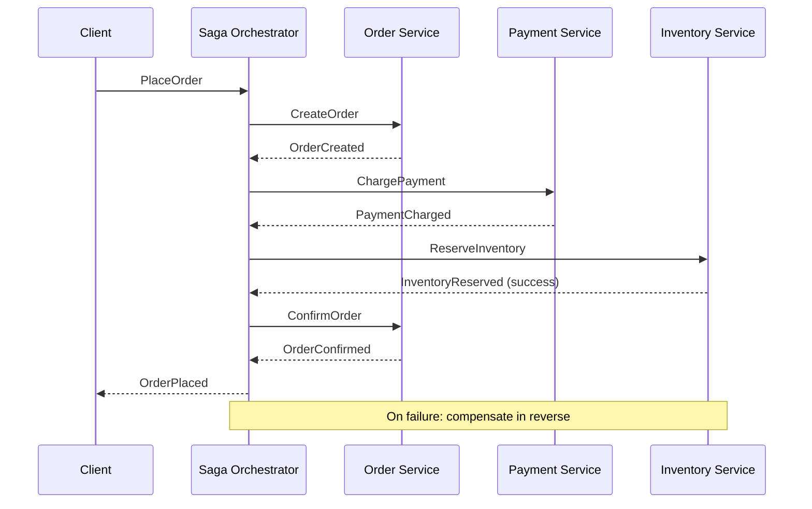
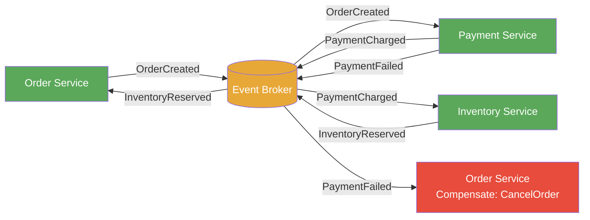

# Saga Pattern

> A pattern for managing data consistency across multiple services in a distributed system by coordinating a sequence of local transactions, each paired with a compensating transaction to undo its effects if a later step fails.

## Overview

In a monolithic system with a shared database, multi-step workflows are straightforward to make atomic using database transactions. In a distributed system — particularly a microservices architecture where each service owns its own data — there is no shared transaction manager. Achieving consistency across service boundaries requires an explicit coordination strategy.

The Saga pattern solves this by decomposing a distributed workflow into a sequence of local transactions. Each local transaction updates data within a single service and publishes an event or sends a command to trigger the next step. If any step fails, the saga executes compensating transactions in reverse order to undo the effects of all preceding steps. The result is not a rollback in the ACID sense — compensating transactions are domain operations, not database reversals — but a semantically consistent outcome.

There are two primary coordination approaches: Choreography, where each service listens for events and decides autonomously what to do next; and Orchestration, where a central coordinator (the saga orchestrator) explicitly directs each step and handles failures. Choreography produces less coupling but makes the workflow harder to trace; orchestration makes the workflow explicit and observable but introduces a central component.

## Intent

- Maintain data consistency across multiple services without distributed ACID transactions.
- Provide a structured approach to handling partial failure in multi-step distributed workflows.
- Make long-running business transactions explicit, observable, and recoverable.
- Allow each service to remain independent while participating in a coordinated workflow.

## When to Use

- Multi-step business workflows that span multiple microservices with separate data stores.
- Workflows where partial failure must be handled gracefully with compensating actions (refund a charge, release reserved inventory).
- Long-running processes where holding a distributed lock for the duration of the workflow is impractical.
- Systems transitioning from a shared database to service-owned data that need to preserve workflow consistency.

## When to Avoid

- Workflows that can be made atomic within a single service or a single database — use a local transaction instead.
- Simple, low-consequence operations where eventual consistency is acceptable without explicit compensation.
- Teams without the operational maturity to monitor saga state, detect stuck sagas, and replay failed steps.

## Structure

### Orchestration Saga

### Choreography Saga

## Key Components

| Component | Responsibility |
|-----------|---------------|
| Saga Orchestrator | (Orchestration only) Central coordinator that drives each step, tracks saga state, and triggers compensations on failure. |
| Local Transaction | A database transaction scoped entirely within a single service. The atomic unit of a saga step. |
| Compensating Transaction | A domain operation that semantically reverses a completed local transaction (e.g., `RefundPayment` reverses `ChargePayment`). |
| Saga State | A persistent record of which steps have completed, which are pending, and whether the saga is in a compensating state. |
| Event Broker | (Choreography) Carries domain events between services; provides the integration fabric for the choreographed saga. |

## Coordination Approaches Compared

| Dimension | Choreography | Orchestration |
|-----------|-------------|---------------|
| Coupling | Loose — services react to events | Moderate — services depend on the orchestrator's commands |
| Observability | Difficult — workflow is implicit across events | Easy — workflow is explicit in the orchestrator |
| Failure handling | Each service handles its own compensation trigger | Orchestrator centrally manages compensation |
| Best for | Simple, well-understood workflows | Complex workflows with many conditional paths |

## Trade-offs

| Benefit | Cost |
|---------|------|
| Enables consistency across services with separate data stores | Compensating transactions are domain operations — they may not be perfectly reversible (side effects like emails cannot be unsent) |
| No distributed locking — each service progresses independently | Saga state must be persisted and recoverable; detecting and recovering stuck sagas requires tooling |
| Makes long-running workflows explicit and auditable | Significantly more complex to design, test, and operate than a local transaction |
| Compatible with eventual consistency and service autonomy | Intermediate states are visible — the system is temporarily inconsistent while the saga progresses |

## Implementation Notes

- Define compensating transactions for every step before building the saga. If a step has no meaningful compensating action, the saga design needs to be reconsidered.
- Persist saga state durably after each step. The orchestrator or each participant must be able to recover and resume after a crash without restarting from the beginning.
- Make all saga steps idempotent. The orchestrator may retry a step on timeout; the participant must produce the same result if the message is received more than once.
- Instrument saga state transitions explicitly. At minimum, log each step's start, success, and failure. Alert on sagas that remain in-progress beyond a defined timeout.
- Prefer orchestration for complex workflows — the explicit state machine in the orchestrator is far easier to reason about, test, and debug than emergent choreography across many services.
- Document the saga workflow, its compensating actions, and its failure modes as an ADR (see [adr/madr](https://github.com/adr/madr)).

## Related Patterns

- [Microservices Architecture](./microservices-architecture.md) — sagas are the primary tool for managing consistency across microservice boundaries.
- [Event-Driven Architecture](./event-driven-architecture.md) — choreographed sagas use EDA's event broker as the integration fabric.
- [CQRS & Event Sourcing](./cqrs-event-sourcing.md) — saga state can be stored as an event-sourced aggregate; events provide the durable record of workflow progress.
- [Domain-Driven Design](./domain-driven-design.md) — saga workflows often correspond to business processes modelled as Process Managers in DDD.

## Further Reading

- [mehdihadeli/awesome-software-architecture](https://github.com/mehdihadeli/awesome-software-architecture) — distributed patterns including saga, outbox, and process manager.
- [DovAmir/awesome-design-patterns](https://github.com/DovAmir/awesome-design-patterns) — distributed transaction patterns and cloud-native consistency approaches.
- [simskij/awesome-software-architecture](https://github.com/simskij/awesome-software-architecture) — concise reference including saga and eventual consistency patterns.
