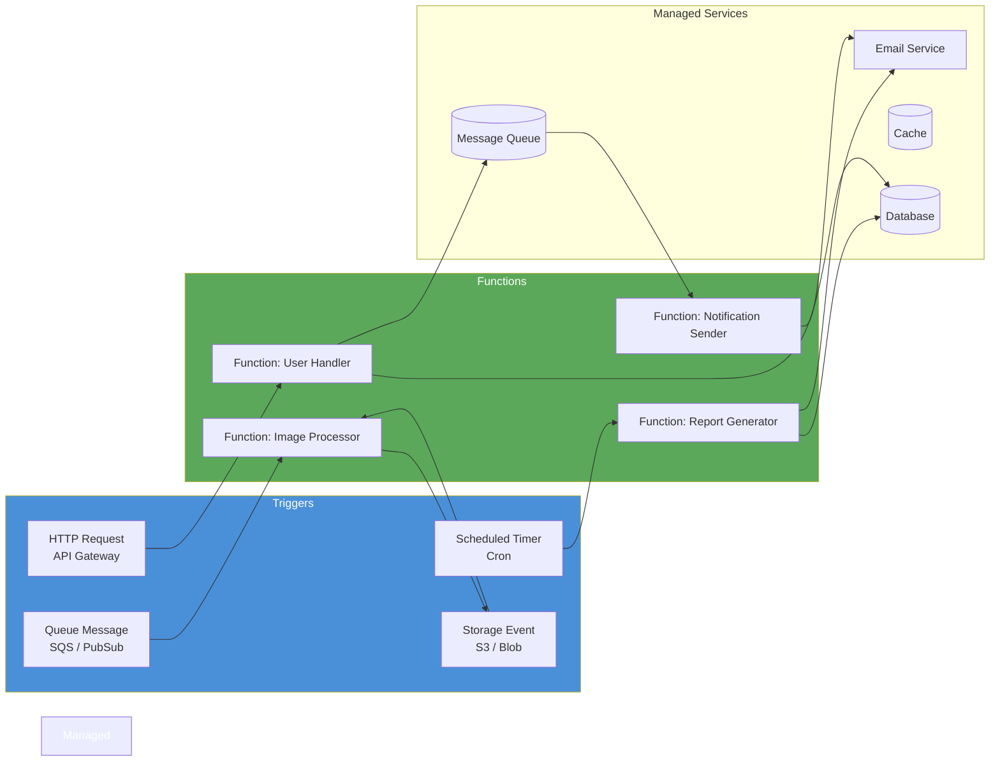

# Serverless Architecture

> An execution model where individual functions are deployed as the unit of scale, with infrastructure provisioning, scaling, and billing managed entirely by the cloud provider.

## Overview

Serverless Architecture — specifically Function-as-a-Service (FaaS) — shifts the operational unit from a long-running server or container to a discrete function. Each function is a stateless, single-purpose handler triggered by an event (HTTP request, queue message, scheduled timer, storage change). The cloud provider allocates compute resources on demand, scales to zero when idle, and bills per invocation.

The defining operational characteristic is the inversion of responsibility: the development team writes business logic and the cloud provider manages capacity, patching, availability, and scaling. This reduces operational overhead significantly for teams that lack deep platform engineering capability. The trade-off is reduced control and a tighter dependency on a specific cloud provider's runtime environment and service ecosystem.

Serverless excels at event-driven, intermittent workloads. A function that processes image uploads, sends a welcome email on user registration, or aggregates nightly reports is well-suited to the model. A function that serves low-latency, synchronous API requests with strict p99 requirements, or that requires persistent state between invocations, is not — each has a better architectural alternative.

## Intent

- Eliminate infrastructure provisioning and operations from the development team's responsibilities.
- Scale individual functions independently and automatically from zero to peak load.
- Achieve a granular, usage-based cost model — pay only for compute consumed, not for idle capacity.
- Enable rapid deployment of isolated, event-driven capabilities without managing a service runtime.

## When to Use

- Event-driven, intermittent workloads: file processing, webhook handlers, scheduled jobs, notification pipelines.
- APIs with highly variable traffic profiles where idle time between bursts would waste provisioned capacity.
- Glue code and integration logic between third-party services that does not warrant a full service.
- Rapid prototyping and low-traffic internal tools where operational simplicity outweighs performance control.

## When to Avoid

- Latency-sensitive APIs with strict p99 requirements — cold starts introduce unpredictable tail latency.
- Long-running computations — most FaaS platforms enforce execution timeouts (seconds to minutes).
- Stateful workloads that require in-memory state between invocations — use a persistent service instead.
- High-throughput, constant-load services where per-invocation billing exceeds the cost of a reserved instance.

## Structure

## Key Components

| Component | Responsibility |
|-----------|---------------|
| Function | Stateless, single-purpose handler containing business logic for one task. The unit of deployment and scaling. |
| Event Trigger | The source that invokes a function: HTTP gateway, queue message, timer, storage event, or stream record. |
| API Gateway | Routes HTTP requests to functions; handles auth, throttling, and protocol transformation. |
| Managed Data Services | External stateful services (databases, caches, queues) that functions interact with; functions themselves are stateless. |
| Function Runtime | The cloud provider's managed execution environment: Lambda, Cloud Functions, Azure Functions, etc. |

## Trade-offs

| Benefit | Cost |
|---------|------|
| Zero infrastructure management — patching, capacity, and availability handled by the provider | Cold starts introduce latency spikes for infrequently invoked or newly scaled functions |
| Scales automatically from zero to peak; no over-provisioning | Vendor lock-in — runtime environment, trigger bindings, and service integrations are provider-specific |
| Granular cost model — pay per invocation and execution duration | Debugging and local development experience is more complex than a conventional service |
| Rapid deployment of isolated capabilities — no service runtime to maintain | Execution time limits and stateless constraint make long-running or stateful workloads difficult |

## Implementation Notes

- Keep functions small and single-purpose. If a function handles more than one concern, split it. The unit of deployment should reflect the unit of change.
- Treat cold start latency as a first-class design constraint. Use provisioned concurrency for latency-sensitive paths, and prefer lighter runtimes (Node.js, Python, Go) over heavier ones (JVM) where cold starts are critical.
- Never store state in function memory between invocations. All state must live in an external service (database, cache, object store). Assume any invocation may execute on a freshly initialised instance.
- Design for idempotency. Triggers (especially queues and event streams) may deliver the same event more than once; functions must produce the same result on duplicate invocations.
- Apply structured logging and distributed tracing from day one. Debugging a graph of loosely connected functions without correlation IDs is extremely difficult.
- Document function topology, trigger sources, and IAM permissions as Architecture Decision Records (see [adr/madr](https://github.com/adr/madr)) — the relationships between functions are easy to lose track of as the system grows.

## Related Patterns

- [Event-Driven Architecture](./event-driven-architecture.md) — serverless functions are naturally event-driven; EDA provides the integration model between functions.
- [Microservices Architecture](./microservices-architecture.md) — serverless can be used to implement individual microservices or to extend a microservices platform.
- [Multi-Tenancy Patterns](./multi-tenancy-patterns.md) — function-level isolation can provide strong tenant separation at low cost.

## Further Reading

- [DovAmir/awesome-design-patterns](https://github.com/DovAmir/awesome-design-patterns) — serverless and cloud-native patterns catalogue.
- [mehdihadeli/awesome-software-architecture](https://github.com/mehdihadeli/awesome-software-architecture) — serverless architecture articles and resources.
- [terravision](https://github.com/patrickchugh/terravision) — generate architecture diagrams from Terraform code for serverless infrastructure.
