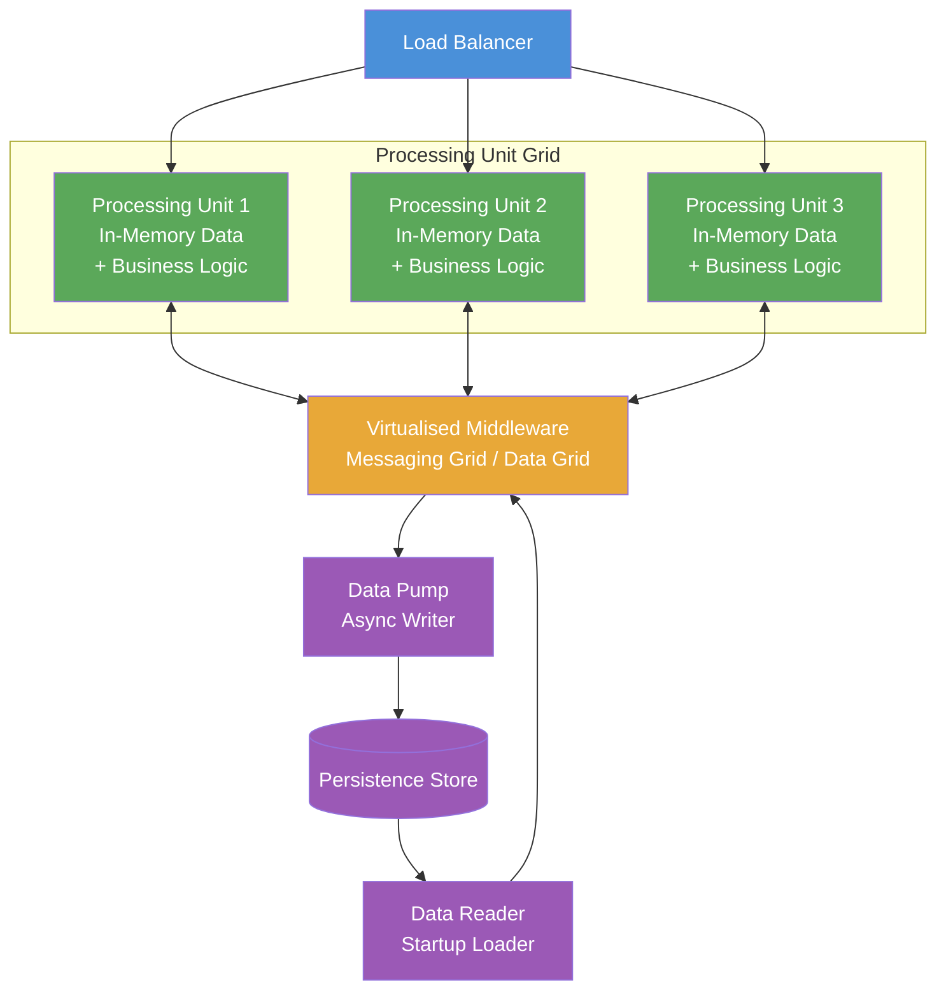

# Space-Based Architecture

> Achieves elastic scalability by distributing both processing and in-memory data across a grid of interchangeable processing units, removing the database as the scaling bottleneck.

## Overview

Space-Based Architecture (SBA) addresses a fundamental bottleneck in traditional web application stacks: the central database. Under high load, a layered or microservices system that routes every transaction through a single relational database quickly saturates connection pools and I/O capacity. Scaling application servers does not help because all traffic converges on the same data tier.

SBA resolves this by eliminating the synchronous database access path from the transaction-handling code. Instead, each Processing Unit (PU) holds a replicated, in-memory copy of the data it needs. When a request arrives, the PU reads from and writes to its local in-memory grid — no network round-trips to a database. A separate asynchronous mechanism (Data Pump) propagates changes to a persistence store for durability.

The "space" in the name refers to the tuple space concept from parallel computing: a shared, distributed, in-memory data fabric that all processing units participate in. Adding capacity means deploying additional processing unit instances; the data grid automatically replicates state to new members. The system can scale to near-arbitrary load by adding instances, and scale back down during quiet periods.

## Intent

- Remove the database as the primary scaling constraint by holding working data in distributed memory.
- Enable elastic, near-linear horizontal scaling by adding and removing processing unit instances dynamically.
- Achieve high availability by replicating data across multiple in-memory grid members with no single point of failure.
- Handle extreme peak load — flash sales, live events, financial market open — without pre-provisioned infrastructure.

## When to Use

- Systems with extreme or unpredictable peak loads that require elastic scaling beyond what a database tier can support.
- Applications with high read/write ratios against a relatively bounded working dataset that fits in distributed memory.
- Platforms where sub-millisecond read latency is required and database round-trips are prohibitive.
- Use cases such as online gaming, live auction platforms, high-frequency trading systems, and large-scale ticketing.

## When to Avoid

- Systems with large, unbounded datasets that cannot be held in distributed memory.
- Applications requiring strong ACID transactional consistency across entities — SBA favours availability and eventual consistency.
- Teams without expertise in distributed systems and in-memory data grid technologies.
- Systems with predictable, moderate load where the cost and complexity of SBA exceeds the scaling benefit.

## Structure

## Key Components

| Component | Responsibility |
|-----------|---------------|
| Processing Unit | Self-contained unit hosting business logic and a replicated in-memory copy of the data grid partition it owns. |
| Virtualised Middleware | Distributed infrastructure layer providing messaging, data replication, and processing unit coordination. |
| Data Grid | Distributed in-memory store shared across processing units; provides read/write access without database I/O. |
| Messaging Grid | Routes requests and events between processing units and external callers. |
| Data Pump | Asynchronous component that writes in-memory state changes to the persistence store for durability. |
| Data Reader | Loads data from the persistence store into the data grid at startup or when a new processing unit joins. |
| Persistence Store | Durable backing store (relational or NoSQL database) used for recovery, not for serving live traffic. |

## Trade-offs

| Benefit | Cost |
|---------|------|
| Near-linear elastic scaling — add instances to absorb load without database bottleneck | Operational complexity of distributed in-memory grids, replication, and consistency management |
| Sub-millisecond read latency — all reads served from local memory | Data grid size bounded by available memory across the cluster — not suitable for large unbounded datasets |
| High availability — data replicated across multiple grid members | Eventual consistency between data grid and persistence store; strong consistency requires explicit design |
| Elastic cost profile — scale in during low traffic, scale out during peaks | Significantly higher infrastructure and expertise cost than conventional patterns |

## Implementation Notes

- Partition the data grid carefully. Partitions should align with business ownership and access patterns — a processing unit should rarely need data from another unit's partition.
- Implement idempotent write operations in the Data Pump. Network failures may cause duplicate writes to the persistence store; the store must tolerate them.
- Define a clear startup sequence: Data Reader must populate the grid before Processing Units begin accepting traffic. Use health checks to enforce this ordering.
- Test failover scenarios explicitly: simulate a processing unit failure and verify that the data grid replicates state correctly to surviving members with no data loss.
- Use the C4 model (see [Structurizr](https://github.com/structurizr)) to communicate the processing unit topology and data grid boundaries to stakeholders.

## Related Patterns

- [Event-Driven Architecture](./event-driven-architecture.md) — SBA's messaging grid is an internal event fabric; combining with EDA connects it to the broader service ecosystem.
- [Microservices Architecture](./microservices-architecture.md) — SBA can be scoped to a single high-throughput microservice rather than applied to the whole system.
- [CQRS & Event Sourcing](./cqrs-event-sourcing.md) — the in-memory data grid serves as a materialised query projection; the persistence store is an event log.

## Further Reading

- [jy-yi/Software-Architecture-Patterns](https://github.com/jy-yi/Software-Architecture-Patterns) — concise space-based pattern reference alongside other core patterns.
- [mehdihadeli/awesome-software-architecture](https://github.com/mehdihadeli/awesome-software-architecture) — broader scalability patterns and distributed systems resources.
- [DovAmir/awesome-design-patterns](https://github.com/DovAmir/awesome-design-patterns) — cloud-native scaling patterns related to SBA.
